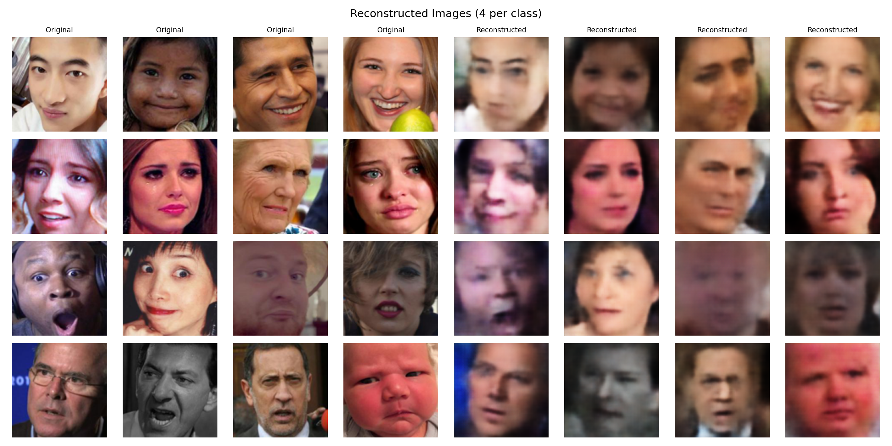
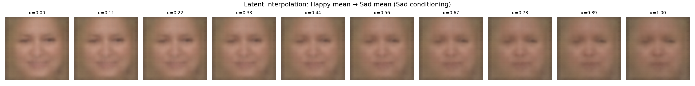
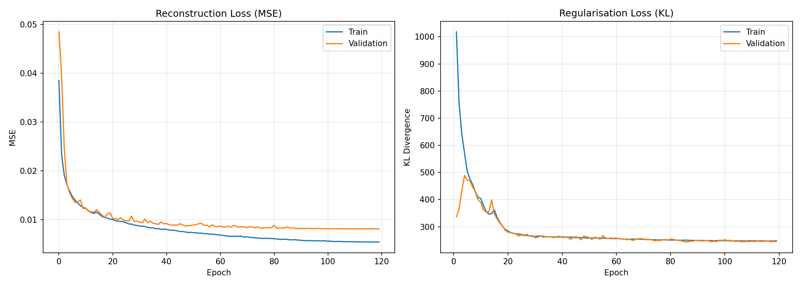
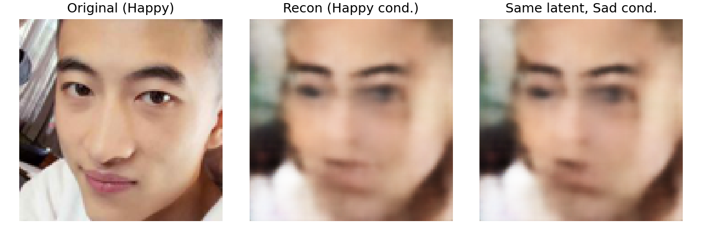

# Conditional VAE — Facial Expression Generation

A Conditional Variational Autoencoder (CVAE) trained on the
[AffectNet](https://arxiv.org/abs/1708.03985) dataset to reconstruct and
generate 112×112 face images conditioned on four expression classes: **Happy,
Sad, Surprised, Mad**. The model learns a continuous latent space that supports
expression transfer and smooth interpolation between emotions.

```
image ──┐                          ┌── μ, log σ² ── z ──┐
        ├─ Encoder (4×Conv + BN) ──┤                     ├─ Decoder (3×ConvT + label injection) ── reconstructed image
label ──┘                          └─────────────────────┘
                                          ↑ label
```

## Results

| Reconstructions | Interpolation (Happy → Sad) |
|:---:|:---:|
|  |  |

| Learning Curves | Expression Transfer |
|:---:|:---:|
|  |  |

## Layout

- `cvae.py` — training script: builds the CVAE, trains for 120 epochs, saves weights + all plots
- `cvae_eval.py` — evaluation script: loads trained weights and regenerates output plots
- `generate_report.py` — builds the PDF report with figures and written analysis
- `encoder.weights.h5` — trained encoder weights (≈28 MB)
- `decoder.weights.h5` — trained decoder weights (≈29 MB)
- `report.pdf` — final PDF report

## Architecture

**Encoder**: 112×112×3 image concatenated with a spatially-broadcast label map
(one-hot → Dense → reshape to 112×112×1), passed through four Conv2D layers
(32, 64, 128, 256 filters, 4×4 kernels, stride 2) with BatchNorm + ReLU.
Flattened features are concatenated with the one-hot label again and mapped
through a 512-unit dense layer to μ and log σ² in a **128-dimensional** latent
space. Sampling via the reparameterisation trick.

**Decoder**: z concatenated with the one-hot label, mapped through dense layers
to a 7×7×256 feature map, then three ConvTranspose2D layers (128, 64, 32
filters) each with **multi-level label injection** — a Dense projection of the
label to a spatial map is concatenated at every resolution. Final transposed
convolution outputs 112×112×3 with sigmoid activation.

**Loss**: MSE reconstruction (summed over pixels) + KL divergence with
**β = 0.15** and linear KL warmup over 20 epochs to prevent posterior collapse.

## Training

| Hyperparameter | Value |
|---|---|
| Latent dimension | 128 |
| Batch size | 64 |
| Epochs | 120 |
| Optimizer | Adam |
| Learning rate | 1e-3 → 1e-5 (cosine decay) |
| β (KL weight) | 0.15 (linear warmup over 20 epochs) |
| Augmentation | Random horizontal flip |
| Checkpointing | Best validation MSE |

## Tasks

1. **Reconstruction** — encode and decode validation images; compare originals vs. reconstructions across all four classes.
2. **Expression transfer (Task 2.1)** — encode a Happy face, decode the same latent with Sad conditioning. Demonstrates that swapping only the label doesn't preserve identity, since the latent code also carries class-specific information.
3. **Latent interpolation (Task 2.2)** — compute mean latent vectors (μ) for Happy and Sad over the training set, interpolate in 10 steps (α = 0 → 1), decode with Sad conditioning. Shows a smooth, gradual transition in expression.

## Setup

Requires a GPU with TensorFlow 2.x.

```bash
pip install tensorflow numpy matplotlib pillow
```

The training script expects the AffectNet dataset at `/import/course/5dv236/vt26/AffectNet`
(university server path). To train on a different machine, update `DATA_DIR` in `cvae.py`.

## Run

```bash
# Train from scratch (saves weights + plots to ~/workspace/lab3_output)
python cvae.py

# Regenerate plots from saved weights
python cvae_eval.py

# Generate the PDF report
python generate_report.py
```
